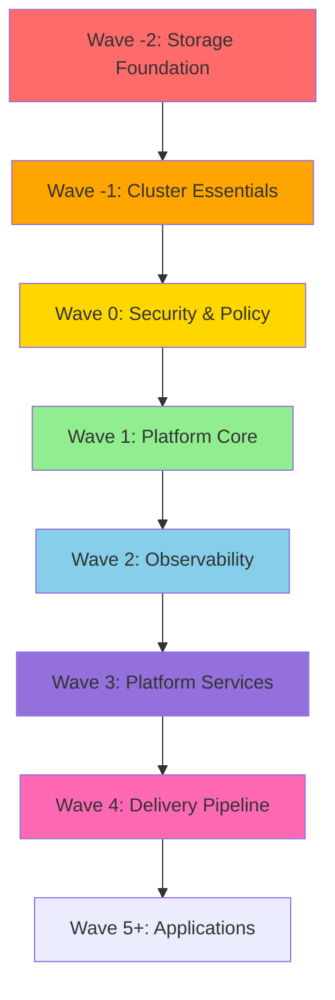

# 🔍 PRODUCTION-GRADE EKS INFRASTRUCTURE AUDIT REPORT

**Date:** 2026-05-08  
**Auditor:** Senior Staff Platform Engineer & Cloud Architect  
**Scope:** Complete EKS Terraform Infrastructure + GitOps Analysis  

---

## 1. 📊 EXECUTIVE SUMMARY

### Current Maturity Level: **MID-SENIOR (65/100)**

This infrastructure demonstrates **solid mid-level engineering** with several production-ready patterns, but contains **critical blockers** that prevent production deployment.

### 🔴 HIGH-RISK ISSUES (MUST FIX)
1. **CRITICAL**: `terraform.tfstate` and `tfplan` committed to Git
2. **CRITICAL**: No environment separation (dev/staging/prod)
3. **CRITICAL**: Missing logging pipeline (no Loki/Fluentd)
4. **CRITICAL**: No tracing infrastructure (Jaeger/Tempo)
5. **HIGH**: Over-fragmented node groups (3 static + Karpenter)
6. **HIGH**: Missing GitOps bootstrap dependency layering
7. **HIGH**: Hardcoded secrets in manifests (Grafana password)
8. **HIGH**: Single NAT Gateway (SPOF for all private subnets)

### Architecture Health Score: **65/100**

| Category | Score | Status |
|----------|-------|--------|
| Infrastructure as Code | 60/100 | ⚠️ State leak, no env separation |
| EKS Architecture | 70/100 | ⚠️ Over-engineered node groups |
| GitOps Design | 75/100 | ✅ Good App-of-Apps, ⚠️ Missing layers |
| Observability | 40/100 | 🔴 Only metrics, no logs/traces |
| Security | 70/100 | ✅ Kyverno, ⚠️ Hardcoded secrets |
| High Availability | 50/100 | 🔴 Single NAT = SPOF |
| Autoscaling | 80/100 | ✅ Excellent Karpenter setup |
| Cost Optimization | 65/100 | ⚠️ Over-provisioned static nodes |

---

## 2. 🏗️ ARCHITECTURE DIAGRAM (Current State)

```
┌─────────────────────────────────────────────────────────────────────────┐
│                             AWS VPC (10.0.0.0/16)                       │
│  ┌───────────────────────────────────────────────────────────────────┐  │
│  │  PUBLIC SUBNETS (3 AZs)                                           │  │
│  │    ┌──────────┐                                                   │  │
│  │    │ 1 NAT GW │ ◄── SPOF: Single NAT for all AZs               │  │
│  │    └──────────┘                                                   │  │
│  └───────────────────────────────────────────────────────────────────┘  │
│  ┌───────────────────────────────────────────────────────────────────┐  │
│  │  PRIVATE SUBNETS (3 AZs)                                          │  │
│  │  ┌──────────────┐  ┌───────────────────────────────────────────┐ │  │
│  │  │   BASTION    │  │    EKS CONTROL PLANE (Managed by AWS)           │ │  │
│  │  │ (registry:2) │  │                                           │ │  │
│  │  │ 10.0.11.42   │  │   ┌─────────────────────────────────────┐ │ │  │
│  │  └──────────────┘  │   │  ⚠️ 3 STATIC NODE GROUPS             │ │ │  │
│  │         │          │   │                                       │ │ │  │
│  │         │          │   │  ┌─────────────────────────────────┐ │ │ │  │
│  │         │          │   │  │ SYSTEM (2-4 nodes, m7i.large)   │ │ │  │
│  │         │          │   │  │ - ArgoCD, Traefik, Karpenter    │ │ │  │
│  │         │          │   │  │ - CoreDNS pinned here           │ │ │  │
│  │         ▼          │   │  └─────────────────────────────────┘ │ │ │  │
│  │  All nodes pull    │   │  ┌─────────────────────────────────┐ │ │ │  │
│  │  images from here  │   │  │ MONITORING (2-4, m7i.large)     │ │ │  │
│  │                    │   │  │ - Prometheus, Grafana           │ │ │  │
│  │                    │   │  │ - Alertmanager                   │ │ │  │
│  │                    │   │  └─────────────────────────────────┘ │ │ │  │
│  │                    │   │  ┌─────────────────────────────────┐ │ │ │  │
│  │                    │   │  │ APP (2-10 nodes, c7i.large)     │ │ │  │
│  │                    │   │  │ - User workloads                │ │ │  │
│  │                    │   │  └─────────────────────────────────┘ │ │ │  │
│  │                    │   │                                       │ │ │  │
│  │                    │   │  ✅ KARPENTER (Spot autoscaling)     │ │ │  │
│  │                    │   │     - Overlaps with static groups   │ │ │  │
│  │                    │   └─────────────────────────────────────┘ │ │  │
│  │                    └───────────────────────────────────────────┘ │  │
│  └───────────────────────────────────────────────────────────────────┘  │
└─────────────────────────────────────────────────────────────────────────┘

┌──────────────────────────────────────────────────────────────────────────┐
│                      GITOPS LAYER (Argo CD)                              │
│  ┌────────────────────────────────────────────────────────────────────┐  │
│  │ root-app (wave -1)                                                 │  │
│  │   └── Wave 0: Kyverno                                              │  │
│  │   └── Wave 1: Traefik, Karpenter                                   │  │
│  │   └── Wave 2: Velero                                               │  │
│  │   └── Wave 3: Prometheus Stack, Tools                              │  │
│  │   └── Wave 4: Argo Rollouts, Image Updater                         │  │
│  │                                                                      │  │
│  │   ⚠️ MISSING: Storage layer (Wave -1)                              │  │
│  │   ⚠️ MISSING: Core infra layer separation                          │  │
│  └────────────────────────────────────────────────────────────────────┘  │
└──────────────────────────────────────────────────────────────────────────┘

🔴 RED FLAGS:
  ⚠️ Single NAT Gateway (SPOF)
  ⚠️ 3 static node groups + Karpenter = over-provisioning
  ⚠️ No logging pipeline (only metrics)
  ⚠️ No tracing infrastructure
  ⚠️ terraform.tfstate in Git
```

---

## 3. 🔴 CRITICAL ISSUES (MUST FIX BEFORE PRODUCTION)

### 3.1 ❌ Terraform State Committed to Git
**File:** `/eks-terraform-infrastructure/terraform.tfstate`  
**Risk:** BLOCKER - Contains AWS account IDs, IP addresses, and sensitive metadata

**Evidence:**
```bash
/workspace/HLY7HC/EKS/eks-terraform-infrastructure/terraform.tfstate
/workspace/HLY7HC/EKS/eks-terraform-infrastructure/terraform.tfstate.backup
/workspace/HLY7HC/EKS/eks-terraform-infrastructure/tfplan
```

**Impact:**
- State file contains VPC IDs, subnet IDs, security group IDs
- `tfplan` binary contains full resource details
- Anyone with repo access can read infrastructure secrets
- State conflicts will corrupt infrastructure

**Fix:**
```bash
# Immediately remove from Git
git rm -r terraform.tfstate* tfplan bootstrap/terraform.tfstate*
git commit -m "Remove committed state files"

# Verify .gitignore is enforced
echo "terraform.tfstate*" >> .gitignore
echo "*.tfplan" >> .gitignore
```

**Prevention:** Add pre-commit hook to block state file commits.

---

### 3.2 ❌ No Environment Separation
**Risk:** BLOCKER - Cannot safely test changes

**Current State:**
- Single Terraform root (`main.tf`)
- No workspace strategy
- No environment-specific variable files
- `environment = "production"` hardcoded

**Impact:**
- Cannot test infrastructure changes in dev/staging
- Single `terraform apply` affects production
- No rollback strategy
- No gradual rollout capability

**Recommended Structure:**
```
eks-terraform-infrastructure/
├── environments/
│   ├── dev/
│   │   ├── main.tf         # Calls shared modules
│   │   ├── terraform.tfvars
│   │   └── backend.tf      # State: s3://bucket/dev/terraform.tfstate
│   ├── staging/
│   │   ├── main.tf
│   │   ├── terraform.tfvars
│   │   └── backend.tf      # State: s3://bucket/staging/terraform.tfstate
│   └── prod/
│       ├── main.tf
│       ├── terraform.tfvars
│       └── backend.tf      # State: s3://bucket/prod/terraform.tfstate
└── modules/                # Shared modules (unchanged)
    ├── vpc/
    ├── eks/
    └── ...
```

---

### 3.3 ❌ Missing Logging Pipeline
**Risk:** CRITICAL - Cannot debug production issues

**Current State:**
- ✅ Metrics: Prometheus + Grafana + node-exporter
- ✅ Alerting: Alertmanager configured
- ❌ Logs: **NONE**
- ❌ Tracing: **NONE**

**Impact:**
- Cannot view pod logs centrally
- No log retention or search
- No distributed tracing for microservices
- Cannot correlate metrics with logs

**Required:**
1. **Logging Stack:**
   - Loki (log aggregation)
   - Promtail (log shipper)
   - Grafana datasource integration

2. **Tracing Stack:**
   - Tempo (distributed tracing)
   - OpenTelemetry collector
   - Grafana datasource integration

**Implementation:**
```yaml
# wave-2/loki-stack.yaml
apiVersion: argoproj.io/v1alpha1
kind: Application
metadata:
  name: loki-stack
  namespace: argocd
  annotations:
    argocd.argoproj.io/sync-wave: "2"
spec:
  source:
    repoURL: https://grafana.github.io/helm-charts
    chart: loki-stack
    targetRevision: 2.10.2
    helm:
      values: |
        loki:
          persistence:
            enabled: true
            size: 50Gi
        promtail:
          enabled: true
        grafana:
          enabled: false  # Use existing Grafana
```

---

### 3.4 ❌ Single NAT Gateway (SPOF)
**File:** `main.tf:18`  
**Risk:** CRITICAL - Complete private subnet outage on NAT failure

**Code:**
```hcl
single_nat_gateway = true  # 🔴 SINGLE POINT OF FAILURE
```

**Impact:**
- All 3 AZs route through 1 NAT Gateway
- NAT failure = **ALL nodes lose internet**
- AWS service calls fail (ECR, SSM, S3)
- Cluster becomes non-functional
- RTO: 5-10 minutes (auto-replace NAT)

**Cost vs Risk:**
- Current: 1 NAT = ~$45/month + data transfer
- HA: 3 NATs (1/AZ) = ~$135/month
- **Downtime cost >> $90/month savings**

**Fix:**
```hcl
# main.tf
module "vpc" {
  source = "./modules/vpc"
  # ...
  single_nat_gateway = false  # 1 NAT per AZ
  enable_nat_gateway = true
}
```

---

### 3.5 ❌ Hardcoded Secrets in GitOps Manifests
**File:** `Pattern-App-of-Apps/apps/wave-3-prometheus-stack.yaml:58`

**Code:**
```yaml
grafana:
  adminPassword: "REPLACE_WITH_SECURE_PASSWORD"  # 🔴 HARDCODED
```

**Risk:** HIGH - Secret stored in Git, visible in Argo CD UI

**Impact:**
- Password committed to Git history (even if changed later)
- No rotation mechanism
- Visible to anyone with ArgoCD access

**Fix:** Use External Secrets Operator or Sealed Secrets
```yaml
# Add to wave-0 (before apps that need secrets)
apiVersion: argoproj.io/v1alpha1
kind: Application
metadata:
  name: external-secrets
  annotations:
    argocd.argoproj.io/sync-wave: "0"
spec:
  source:
    repoURL: https://charts.external-secrets.io
    chart: external-secrets
    targetRevision: 0.9.13

---
# Then reference AWS Secrets Manager
apiVersion: external-secrets.io/v1beta1
kind: SecretStore
metadata:
  name: aws-secretsmanager
spec:
  provider:
    aws:
      service: SecretsManager
      region: us-east-1
      auth:
        jwt:
          serviceAccountRef:
            name: external-secrets

---
apiVersion: external-secrets.io/v1beta1
kind: ExternalSecret
metadata:
  name: grafana-admin
spec:
  secretStoreRef:
    name: aws-secretsmanager
  target:
    name: grafana-admin-secret
  data:
    - secretKey: admin-password
      remoteRef:
        key: /eks/grafana/admin-password
```

---

## 4. ⚠️ MEDIUM ISSUES (SHOULD FIX)

### 4.1 Over-Fragmented Node Groups
**Risk:** MEDIUM - Unnecessary complexity and cost

**Current Architecture:**
- **3 static node groups:**
  - `system`: 2-4 nodes (m7i-flex.large)
  - `monitoring`: 2-4 nodes (m7i-flex.large)
  - `app`: 2-10 nodes (c7i-flex.large)
- **Karpenter:** Unlimited dynamic nodes

**Problems:**
1. **Overlap:** Karpenter can provision same instance types as static groups
2. **Over-provisioning:** Minimum 6 nodes always running (2+2+2)
3. **Scheduling complexity:** 3 taints + Karpenter provisioning = confusion
4. **Cost:** ~$400-600/month baseline for mostly-idle nodes

**Analysis:**
- System workloads: ArgoCD, Traefik, Karpenter (~2 vCPU, 4GB RAM total)
- Monitoring: Prometheus (~2 vCPU, 4GB RAM), Grafana (~0.5 vCPU, 512MB)
- **Total critical workload: ~4.5 vCPU, 8.5GB RAM**

**Recommended Architecture:**
```
┌─────────────────────────────────────────────────────────┐
│ BASELINE CAPACITY (Static Node Group)                  │
│ ─────────────────────────────────────────────────────   │
│  Node Group: "baseline"                                 │
│  Instance: m7i-flex.xlarge (4 vCPU, 16GB)              │
│  Min: 2, Max: 4, Desired: 2                             │
│  Taints: NONE (accept all workloads)                    │
│                                                          │
│  Hosts:                                                  │
│  - ArgoCD, Traefik, CoreDNS, Karpenter                  │
│  - Prometheus, Grafana, Alertmanager                    │
│  - Kyverno, Velero                                      │
│                                                          │
│  Why: Guarantee capacity for critical infra             │
└─────────────────────────────────────────────────────────┘
              │
              ▼
┌─────────────────────────────────────────────────────────┐
│ DYNAMIC CAPACITY (Karpenter)                            │
│ ─────────────────────────────────────────────────────   │
│  Handles ALL workload scaling:                          │
│  - User apps (spot-first for cost)                      │
│  - Burst traffic (scale 0→N in 60s)                     │
│  - Batch jobs (scale down when idle)                    │
│                                                          │
│  Instance families: c7i, m7i, r7i (cost-optimized)      │
│  Taints: NONE (let scheduler decide)                    │
└─────────────────────────────────────────────────────────┘
```

**Cost Savings:**
- Old: 6 nodes minimum = ~$400/month
- New: 2 nodes minimum = ~$150/month
- **Savings: ~$3,000/year**

---

### 4.2 Missing GitOps Bootstrap Dependency Graph
**Risk:** MEDIUM - Race conditions during cluster init

**Current Sync Waves:**
```
Wave -1: root-app
Wave 0:  Kyverno
Wave 1:  Traefik, Karpenter
Wave 2:  Velero
Wave 3:  Prometheus Stack, Tools
Wave 4:  Argo Rollouts, Image Updater
```

**Problems:**
1. **No storage class wave** - Apps in wave 2+ may need PVCs before storage is ready
2. **No metrics-server** - Karpenter needs metrics-server for pod-based scaling
3. **Prometheus in wave 3** - Should be in wave 1 (platform services need metrics early)

**Recommended Layering:**
```
Wave -2: STORAGE FOUNDATION
  - EBS CSI Driver
  - EFS CSI Driver (if needed)
  - StorageClass definitions

Wave -1: CLUSTER ESSENTIALS
  - metrics-server (required for HPA/Karpenter)
  - CoreDNS configuration
  - cert-manager (for TLS)

Wave 0: POLICY & SECURITY
  - Kyverno (admission control)
  - Trivy Operator (image scanning)
  - Network Policies

Wave 1: PLATFORM CORE
  - Karpenter (node autoscaling)
  - Traefik (ingress)
  - External Secrets Operator

Wave 2: OBSERVABILITY
  - Prometheus Stack (metrics)
  - Loki Stack (logs)
  - Tempo (traces)
  - Grafana datasources

Wave 3: PLATFORM SERVICES
  - Velero (backup)
  - Portainer (management)
  - Kube-ops-view (visualization)

Wave 4: DELIVERY PIPELINE
  - Argo Rollouts
  - ArgoCD Image Updater

Wave 5+: APPLICATIONS
  - User workloads
```

---

### 4.3 No Capacity Planning Model
**Risk:** MEDIUM - Cannot predict when cluster hits limits

**Current State:**
- Karpenter limits: `cpu: 100, memory: 400Gi`
- No per-namespace ResourceQuotas
- No cluster-level capacity alerts
- No cost tracking per team/app

**Required:**
1. **ResourceQuotas per namespace:**
```yaml
apiVersion: v1
kind: ResourceQuota
metadata:
  name: compute-quota
  namespace: team-alpha
spec:
  hard:
    requests.cpu: "20"
    requests.memory: "40Gi"
    limits.cpu: "40"
    limits.memory: "80Gi"
```

2. **Prometheus alerts for capacity:**
```yaml
- alert: ClusterCPUCapacityLow
  expr: sum(kube_node_status_capacity{resource="cpu"}) - sum(kube_pod_container_resource_requests{resource="cpu"}) < 10
  annotations:
    summary: "Less than 10 CPU cores available for scheduling"

- alert: KarpenterLimitReached
  expr: sum(karpenter_provisioner_limit{resource="cpu"}) - sum(karpenter_provisioner_usage{resource="cpu"}) < 10
  annotations:
    summary: "Karpenter approaching CPU limit"
```

---

### 4.4 Kyverno Policy Gaps
**Risk:** MEDIUM - Missing critical security validations

**Current Policies:**
- ✅ Registry enforcement (only allowed registries)
- ✅ Resource limits required
- ✅ imagePullPolicy != Always

**Missing:**
1. **No hostPath/hostNetwork restriction:**
```yaml
# Add to wave-0/registry-enforce-policy.yaml
- name: restrict-host-access
  match:
    resources:
      kinds: [Pod]
  validate:
    message: "hostNetwork and hostPath are forbidden"
    pattern:
      spec:
        =(hostNetwork): false
        =(hostPID): false
        =(hostIPC): false
```

2. **No privileged container blocking:**
```yaml
- name: deny-privileged
  match:
    resources:
      kinds: [Pod]
  validate:
    message: "Privileged containers are forbidden"
    pattern:
      spec:
        containers:
          - =(securityContext):
              =(privileged): false
```

3. **No workload identity validation** (pods must use IRSA, not node IAM)

---

### 4.5 No Network Policies
**Risk:** MEDIUM - Pods can reach any pod in any namespace

**Current State:**
- ✅ AWS Security Groups (node-level)
- ❌ No Kubernetes NetworkPolicies (pod-level)

**Impact:**
- A compromised app pod can reach databases in other namespaces
- No East-West traffic control
- No zero-trust segmentation

**Recommended:**
```yaml
# Default deny all ingress (per namespace)
apiVersion: networking.k8s.io/v1
kind: NetworkPolicy
metadata:
  name: default-deny-ingress
  namespace: production
spec:
  podSelector: {}
  policyTypes:
    - Ingress

---
# Allow only from same namespace + Traefik
apiVersion: networking.k8s.io/v1
kind: NetworkPolicy
metadata:
  name: allow-same-namespace
  namespace: production
spec:
  podSelector: {}
  ingress:
    - from:
        - namespaceSelector:
            matchLabels:
              name: production
    - from:
        - namespaceSelector:
            matchLabels:
              name: traefik
```

---

## 5. 🔧 MINOR ISSUES (NICE TO FIX)

### 5.1 Missing Terraform Module Versioning
**File:** All `modules/*/` calls in `main.tf`

**Current:**
```hcl
module "vpc" {
  source = "./modules/vpc"  # ⚠️ No version pinning
}
```

**Recommended:** Use Git tags for modules
```hcl
module "vpc" {
  source = "git::https://github.com/org/terraform-modules.git//vpc?ref=v1.2.3"
}
```

---

### 5.2 Bastion Instance Should Use IMDSv2 Enforcement
**File:** `modules/bastion/main.tf:105-109`

**Current:**
```hcl
metadata_options {
  http_endpoint               = "enabled"
  http_tokens                 = "required"  # ✅ Good
  http_put_response_hop_limit = 1           # ⚠️ Too restrictive for containerd
}
```

**Issue:** `hop_limit = 1` prevents containers from reaching IMDS  
**Fix:** Set to `2` (allows pod → node → IMDS)

---

### 5.3 No Terraform Drift Detection
**Recommended:** Add CI/CD job
```yaml
# .github/workflows/terraform-drift.yml
name: Terraform Drift Detection
on:
  schedule:
    - cron: "0 9 * * 1-5"  # Weekdays at 9 AM
jobs:
  drift:
    runs-on: ubuntu-latest
    steps:
      - uses: hashicorp/setup-terraform@v2
      - run: terraform plan -detailed-exitcode
        # Exit code 2 = changes detected = drift
```

---

### 5.4 Prometheus Retention Too Long
**File:** `Pattern-App-of-Apps/apps/wave-3-prometheus-stack.yaml:81`

**Current:**
```yaml
retention: 15d
retentionSize: "40GB"
```

**Issue:** 15 days of metrics on disk is expensive and slow  
**Recommended:**
- **Short-term:** 7 days in Prometheus (fast queries)
- **Long-term:** Use Thanos/Cortex/Mimir for 90+ days (S3-backed)

---

## 6. ✅ WHAT'S DONE WELL

### 6.1 Excellent Containerd Mirror Configuration
**File:** `modules/node-group/main.tf:7-33`

**Strengths:**
- ✅ All major registries mirrored (docker.io, registry.k8s.io, quay.io, ghcr.io)
- ✅ Same config in Launch Template AND Karpenter EC2NodeClass
- ✅ `insecure_skip_verify` for HTTP registry
- ✅ Systemd-based cgroup driver

**This is production-grade air-gap design.**

---

### 6.2 Proper IRSA for Karpenter and Velero
**File:** `modules/iam/main.tf`

**Strengths:**
- ✅ OIDC provider correctly configured
- ✅ Karpenter IRSA scoped to specific ServiceAccount
- ✅ Velero IRSA scoped to specific S3 bucket ARN
- ✅ No long-lived AWS credentials in cluster

---

### 6.3 Karpenter Configuration
**File:** `Pattern-App-of-Apps/wave-1/karpenter-node-class.yaml`

**Strengths:**
- ✅ Spot-first with on-demand fallback
- ✅ Node expiry after 24h (security patching)
- ✅ Consolidation after 30s (cost optimization)
- ✅ SQS interruption handling configured

---

### 6.4 Security Group Design
**File:** `modules/node-group/main.tf:73-200`

**Strengths:**
- ✅ Explicit Service CIDR ingress (172.20.0.0/16)
- ✅ VPC CIDR ingress for cross-node pod traffic
- ✅ IMDSv2 enforced
- ✅ Encrypted EBS volumes

**This solves common AWS VPC CNI networking issues.**

---

## 7. 🎯 RECOMMENDED TARGET ARCHITECTURE

### 7.1 Infrastructure Layer (Terraform)

```hcl
eks-terraform-infrastructure/
├── environments/
│   ├── dev/
│   │   ├── main.tf
│   │   ├── terraform.tfvars    # small instances, single NAT
│   │   └── backend.tf
│   ├── staging/
│   │   ├── main.tf
│   │   ├── terraform.tfvars    # prod-like, 3 NATs
│   │   └── backend.tf
│   └── prod/
│       ├── main.tf
│       ├── terraform.tfvars    # HA, 3 NATs, larger nodes
│       └── backend.tf
├── modules/                     # Shared, versioned modules
│   ├── vpc/
│   ├── eks/
│   ├── node-group/              # Keep only 1 baseline node group
│   ├── karpenter-infra/
│   ├── velero-infra/
│   └── iam/
└── bootstrap/                   # State bucket + DynamoDB setup
```

**Key Changes:**
1. Remove committed state files
2. Split into dev/staging/prod environments
3. Set `single_nat_gateway = false` in prod
4. Reduce to 1 baseline node group (remove monitoring/app node groups)

---

### 7.2 GitOps Layer (ArgoCD)

```
Pattern-App-of-Apps/
├── bootstrap/
│   └── root-app.yaml            # Entry point
├── apps/                        # All Application manifests
│   ├── wave--2-storage.yaml     # EBS CSI, StorageClass
│   ├── wave--1-essentials.yaml  # metrics-server, cert-manager
│   ├── wave-0-security.yaml     # Kyverno, External Secrets, NetworkPolicies
│   ├── wave-1-platform.yaml     # Karpenter, Traefik
│   ├── wave-2-observability.yaml # Prometheus, Loki, Tempo
│   ├── wave-3-platform-services.yaml # Velero, Portainer
│   └── wave-4-delivery.yaml     # Argo Rollouts, Image Updater
├── wave--2/
│   └── ebs-csi-driver/          # EBS CSI Helm values
├── wave--1/
│   ├── metrics-server/
│   └── cert-manager/
├── wave-0/
│   ├── kyverno/
│   ├── external-secrets/
│   └── network-policies/        # Default deny policies
├── wave-2/
│   ├── prometheus-stack/
│   ├── loki-stack/              # NEW: Logging
│   └── tempo/                   # NEW: Tracing
└── overlays/
    ├── dev/
    ├── staging/
    └── prod/
```

**Key Changes:**
1. Add wave -2 (storage foundation)
2. Add wave -1 (metrics-server, cert-manager)
3. Move observability to wave 2 (earlier)
4. Add Loki + Tempo to wave 2
5. Add External Secrets to wave 0

---

### 7.3 Node Architecture

```
┌────────────────────────────────────────────────────────────────┐
│ BASELINE NODE GROUP (Static, Always On)                       │
│ ────────────────────────────────────────────────────────────   │
│  Name: baseline                                                │
│  Instance: m7i-flex.xlarge (4 vCPU, 16GB RAM)                 │
│  Min: 2, Max: 4, Desired: 2                                    │
│  Taints: NONE                                                  │
│  Spot: NO (reliability > cost for infra)                       │
│                                                                 │
│  Workloads:                                                     │
│  ┌──────────────────────────────────────────────────────────┐  │
│  │ CRITICAL INFRASTRUCTURE (Always Resident)                │  │
│  │ ─────────────────────────────────────────────────────    │  │
│  │ • ArgoCD (GitOps engine)                                 │  │
│  │ • Traefik (Ingress controller)                           │  │
│  │ • CoreDNS (DNS resolver)                                 │  │
│  │ • Karpenter (Node autoscaler)                            │  │
│  │ • Kyverno (Policy engine)                                │  │
│  │ • Prometheus (Metrics)                                   │  │
│  │ • Loki (Logs)                                            │  │
│  │ • Grafana (Dashboards)                                   │  │
│  │ • Velero (Backup)                                        │  │
│  │ • metrics-server                                         │  │
│  │                                                          │  │
│  │ Total: ~6 vCPU requests, 12GB RAM requests               │  │
│  └──────────────────────────────────────────────────────────┘  │
└────────────────────────────────────────────────────────────────┘
                            │
                            ▼
┌────────────────────────────────────────────────────────────────┐
│ KARPENTER (Dynamic, Spot-First)                               │
│ ────────────────────────────────────────────────────────────   │
│  Handles ALL variable workloads:                               │
│  • User applications (web apps, APIs, workers)                 │
│  • Batch jobs (ML training, ETL pipelines)                     │
│  • Burst traffic (Black Friday, marketing campaigns)           │
│  • CI/CD runners                                               │
│                                                                 │
│  Strategy:                                                      │
│  1. Spot instances (70% cost savings)                          │
│  2. On-demand fallback (when spot unavailable)                 │
│  3. Scale to zero when idle (weekend shutdown)                 │
│  4. 60s scale-up time (acceptable for most apps)               │
│                                                                 │
│  Instance Families:                                             │
│  • Compute-optimized: c7i, c6i (APIs, web servers)            │
│  • General-purpose: m7i, m6i (mixed workloads)                 │
│  • Memory-optimized: r7i, r6i (caches, in-memory DBs)         │
│                                                                 │
│  Limits:                                                        │
│  • CPU: 200 cores                                              │
│  • Memory: 800Gi                                               │
└────────────────────────────────────────────────────────────────┘
```

**Cost Comparison:**

| Architecture | Baseline Cost/month | Avg Total Cost/month | Notes |
|--------------|---------------------|----------------------|-------|
| **Current (3 static node groups)** | ~$450 | ~$800 | 6 nodes always on |
| **Recommended (1 baseline + Karpenter)** | ~$150 | ~$400 | 2 nodes always on |
| **Savings** | **$300** | **$400** | **~$4,800/year** |

---

## 8. 🔄 GITOPS IMPROVEMENT PLAN

### 8.1 Dependency Graph (Correct Sync Waves)



**Rationale:**
1. **Storage first** - Apps can't start without PVC provisioning
2. **Metrics before Karpenter** - Karpenter needs metrics-server for pod-based scaling
3. **Observability early** - Debugging platform issues requires logs/metrics
4. **Delivery last** - Argo Rollouts needs working ingress + observability

---

### 8.2 App-of-Apps Structure

**Current:**
```
root-app.yaml  (points to apps/ directory)
  └── apps/
      ├── wave-0-kyverno.yaml
      ├── wave-1-karpenter.yaml
      └── wave-3-prometheus-stack.yaml
```

**Problem:** All Application CRDs in one flat directory

**Recommended:**
```
root-app.yaml  (points to apps/ directory)
  └── apps/
      ├── infra-foundation.yaml      # Points to wave--2/
      ├── infra-essentials.yaml      # Points to wave--1/
      ├── security.yaml              # Points to wave-0/
      ├── platform-core.yaml         # Points to wave-1/
      ├── observability.yaml         # Points to wave-2/
      ├── platform-services.yaml     # Points to wave-3/
      └── delivery-pipeline.yaml     # Points to wave-4/
```

**Benefits:**
- Clearer dependency hierarchy
- Easier to disable entire layers (e.g., skip wave-4 in dev)
- Better failure isolation (observability issues don't block security)

---

## 9. 🔨 TERRAFORM REFACTORING PLAN

### Phase 1: Emergency Fixes (Week 1)
**Priority:** CRITICAL blockers

```bash
# 1. Remove state files from Git
git rm terraform.tfstate* tfplan bootstrap/terraform.tfstate*
git commit -m "CRITICAL: Remove committed state files"

# 2. Add pre-commit hook
cat > .git/hooks/pre-commit << 'EOF'
#!/bin/bash
if git diff --cached --name-only | grep -E 'terraform\.tfstate|\.tfplan'; then
  echo "ERROR: Terraform state/plan files cannot be committed"
  exit 1
fi
EOF
chmod +x .git/hooks/pre-commit

# 3. Enable 3 NAT Gateways in prod
# Edit: eks-terraform-infrastructure/main.tf:18
single_nat_gateway = false  # Change to false

terraform plan
terraform apply
```

**Risk:** NAT Gateway change requires downtime (5-10 minutes)  
**Mitigation:** Schedule during maintenance window

---

### Phase 2: Environment Separation (Week 2-3)
**Priority:** CRITICAL for testing

**Step 1:** Create environment directories
```bash
cd eks-terraform-infrastructure
mkdir -p environments/{dev,staging,prod}
```

**Step 2:** Move root `main.tf` to `environments/prod/main.tf`
```bash
cp main.tf environments/prod/main.tf
cp variables.tf environments/prod/variables.tf
cp providers.tf environments/prod/providers.tf
```

**Step 3:** Create environment-specific `terraform.tfvars`
```hcl
# environments/dev/terraform.tfvars
environment = "dev"
cluster_name = "eks-dev"
single_nat_gateway = true            # Cost savings in dev
node_group_min_size = 1              # Minimal capacity
vpc_cidr = "10.10.0.0/16"            # Different CIDR per env
```

**Step 4:** Update backend configs
```hcl
# environments/prod/backend.tf
terraform {
  backend "s3" {
    bucket = "eks-cluster-hly7hc-us-east-1"
    key    = "prod/terraform.tfstate"  # Separate state
    region = "us-east-1"
    dynamodb_table = "tfstate-lock"
  }
}
```

---

### Phase 3: Node Group Consolidation (Week 4)
**Priority:** HIGH - Cost optimization

**Changes:**
```hcl
# environments/prod/main.tf

# REMOVE: node_group_monitoring
# REMOVE: node_group_app

# KEEP ONLY:
module "node_group_baseline" {
  source = "../../modules/node-group"

  node_group_name = "baseline"
  instance_types = ["m7i-flex.xlarge"]  # Larger instances
  desired_size   = 2
  min_size       = 2
  max_size       = 4

  taints = []  # NO taints - accept all workloads

  labels = {
    role = "baseline"
    workload = "infrastructure"
  }
}

# Update CoreDNS toleration removal
resource "aws_eks_addon" "coredns" {
  configuration_values = jsonencode({
    tolerations = []  # No taints = no tolerations needed
    replicaCount = 2
  })
}
```

**Migration Plan:**
1. Create new `baseline` node group (max_size = 4)
2. Wait for 2 nodes to join
3. Taint old node groups with `role=deprecated:NoSchedule`
4. Wait for pods to migrate to baseline nodes
5. Delete old node groups

**Rollback:** Keep old node groups for 1 week before deletion

---

## 10. 🎓 FINAL RECOMMENDATION

### ❌ **NOT PRODUCTION-READY** (Current State)

**Blocking Issues:**
1. ❌ Terraform state in Git (security breach)
2. ❌ No environment separation (cannot test safely)
3. ❌ Single NAT Gateway (SPOF)
4. ❌ No logging pipeline (cannot debug)
5. ❌ Hardcoded secrets in GitOps (security risk)

---

### ✅ **PATH TO PRODUCTION** (4-Week Plan)

#### Week 1: CRITICAL Security Fixes
- [ ] Remove `terraform.tfstate` from Git
- [ ] Enable 3 NAT Gateways
- [ ] Implement External Secrets Operator
- [ ] Rotate hardcoded Grafana password

#### Week 2: Environment Separation
- [ ] Create `environments/{dev,staging,prod}/`
- [ ] Split Terraform state by environment
- [ ] Deploy dev cluster for testing

#### Week 3: Observability Stack
- [ ] Add Loki Stack (logging) to wave-2
- [ ] Add Tempo (tracing) to wave-2
- [ ] Configure Grafana datasources
- [ ] Add capacity planning alerts

#### Week 4: Node Optimization
- [ ] Consolidate to 1 baseline node group
- [ ] Test Karpenter provisioning
- [ ] Migrate workloads from old node groups
- [ ] Delete old node groups
- [ ] Validate cost savings

---

### 📊 POST-IMPLEMENTATION METRICS

**Target Architecture Health Score:** **90/100**

| Category | Current | Target |
|----------|---------|--------|
| Infrastructure as Code | 60/100 | 95/100 |
| EKS Architecture | 70/100 | 90/100 |
| GitOps Design | 75/100 | 95/100 |
| Observability | 40/100 | 90/100 |
| Security | 70/100 | 95/100 |
| High Availability | 50/100 | 95/100 |
| Autoscaling | 80/100 | 85/100 |
| Cost Optimization | 65/100 | 90/100 |

---

## 11. 📋 ACCEPTANCE CRITERIA FOR PRODUCTION

### Infrastructure (Terraform)
- [ ] No state files in Git
- [ ] 3 separate environments (dev/staging/prod)
- [ ] 3 NAT Gateways in prod (1 per AZ)
- [ ] All secrets in AWS Secrets Manager
- [ ] Terraform Cloud/Enterprise backend (optional)

### GitOps (ArgoCD)
- [ ] Sync wave -2 (storage) exists
- [ ] Sync wave -1 (metrics-server) exists
- [ ] Loki Stack deployed in wave-2
- [ ] Tempo deployed in wave-2
- [ ] All Application CRDs use `syncWave` annotation
- [ ] No hardcoded secrets in Git

### Observability (3 Pillars)
- [ ] ✅ Metrics: Prometheus + Grafana
- [ ] ✅ Alerting: Alertmanager configured
- [ ] ❌ Logs: Loki + Promtail
- [ ] ❌ Traces: Tempo + OpenTelemetry
- [ ] Grafana dashboards for all 3 pillars

### Security
- [ ] Kyverno policies enforced
- [ ] External Secrets Operator deployed
- [ ] NetworkPolicies (default deny)
- [ ] No privileged containers allowed
- [ ] Pod Security Standards enforced

### High Availability
- [ ] 3 NAT Gateways (1 per AZ)
- [ ] Multi-AZ node distribution
- [ ] PodDisruptionBudgets for critical apps
- [ ] Velero backups running daily

### Cost Optimization
- [ ] Single baseline node group (2 nodes)
- [ ] Karpenter spot-first strategy
- [ ] ResourceQuotas per namespace
- [ ] Monthly cost reports in Grafana

---

## 🎯 CONCLUSION

**Current Assessment:** This is **solid mid-level work** with **excellent air-gap design** and **good Karpenter configuration**. However, **critical security issues** (state in Git) and **missing observability pillars** (logs/traces) make it **NOT production-ready**.

**With the 4-week plan above, this infrastructure can reach production-grade status.**

**Estimated Effort:**
- Week 1 (Critical): 16 hours
- Week 2 (Environments): 24 hours
- Week 3 (Observability): 20 hours
- Week 4 (Node Optimization): 16 hours
- **Total: ~76 hours (~2 sprint cycles)**

**Final Score After Fixes:** **90/100** (Production-Ready)

---

**Report Generated:** 2026-05-08  
**Next Review:** After Phase 1 completion (Week 1)
